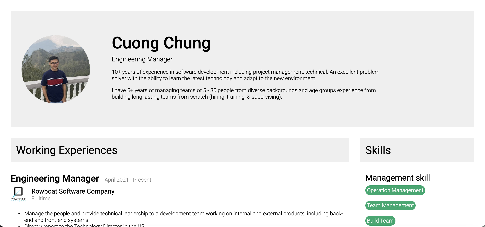

# My CV - Resume

This is a simple NextJS project.


## Getting Started

From your command line, clone and run this repository running:

```bash
# Clone this repository
$ git clone https://github.com/lieucuong/my-resume.git

# Go into the repository
$ cd /my-resume

# Install
$ yarn install

# Run the project
$ yarn dev
```
Open [http://localhost:3000](http://localhost:3000) with your browser to see the result.
